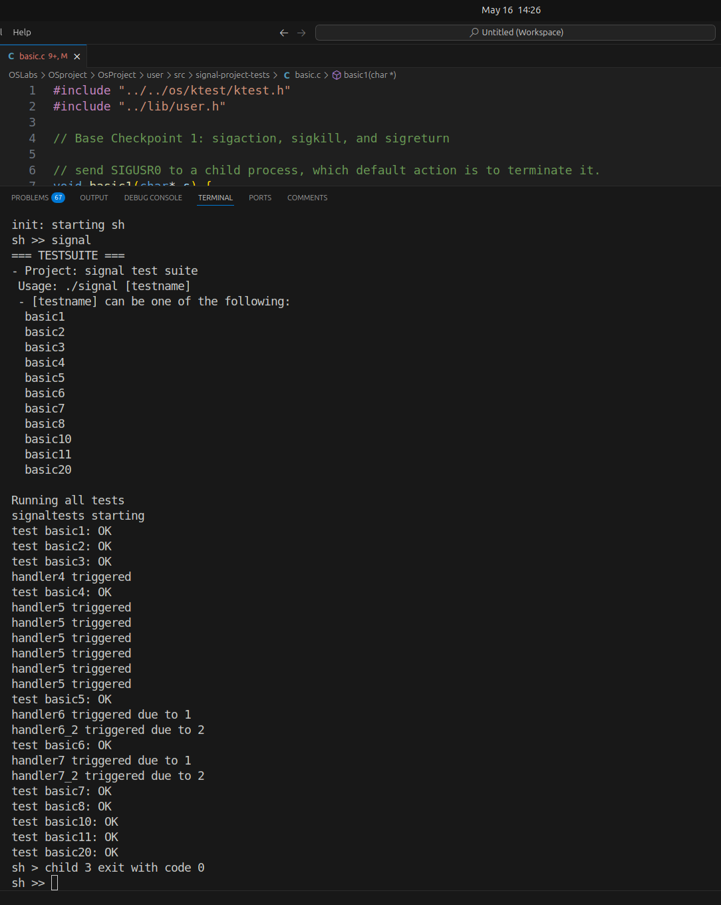

# Project Report (Submission 1)

## 1. Group Members
- 黄棨麟 12212517
- 刘洪玮 12212304
- 朱宇昊 12211224

## 2. Project Overview
本项目在 xv6 内核上实现了类 POSIX 信号机制，包含以下功能：
1. 基本系统调用：`sigaction`、`sigprocmask`、`sigpending`、`sigkill`、`sigreturn`  
2. 在每次从内核返回用户态前检查并交付 Pending 信号  
3. 支持默认处理 (SIG_DFL)、忽略 (SIG_IGN)
4. 信号阻塞与解阻 (`sigprocmask`)、挂起查询 (`sigpending`)  
5. 信号在 `fork` / `exec` 过程中的继承与重置  
6. 特殊信号 SIGKILL、SIGSTOP: 不可被阻塞或忽略，立即终止或暂停

**所有功能均通过项目提供的 signal 测试**

## 3. 代码仓库与分支管理
https://github.com/sinonnhana/OsProject


**提交记录**：


## 4. 设计与实现

### 4.1 核心数据结构 (`ksignal.h`)

已有实现

```c
struct ksignal {
  sigaction_t sa[SIGMAX + 1];
  siginfo_t   siginfos[SIGMAX + 1];
  sigset_t    sigmask;       // 已阻塞信号集合
  sigset_t    sigpending;    // 挂起信号集合
};
```
- `sa[]` 存储每个信号的处理方式  
- `sigmask`：当前阻塞的信号位图  
- `sigpending`：已生成尚未交付的信号位图  
- `siginfos[]`：每个挂起信号的额外信息 (`si_signo`、`si_pid`、`si_code` 等)

### 4.2 信号初始化
- `siginit(proc *p)`：在 `allocproc` 中调用  
  - 清空 `sigmask`、`sigpending`  
  - 将所有 `sa[s]` 设为 `SIG_DFL`  
  - 将所有 `siginfos` 清零  

```c
int siginit(struct proc *p) {
  p->signal.sigmask = 0;
  p->signal.sigpending = 0;
  for (int s = SIGMIN; s <= SIGMAX; s++) {
    p->signal.sa[s].sa_sigaction = SIG_DFL;
    p->signal.sa[s].sa_mask      = 0;
    p->signal.sa[s].sa_restorer = NULL;
    memset(&p->signal.siginfos[s], 0, sizeof(siginfo_t));
  }
  return 0;
}
```

### 4.3 信号在 fork/exec 继承与重置
- **fork** (`siginit_fork`)：  
  - 子进程继承父进程的 `sa[]` 和 `sigmask`  
  - 清空 `sigpending` 和 `siginfos`  
- **exec** (`siginit_exec`)：  
  - 保留 `sigmask` 与 `sigpending`  
  - 除了已被设为 `SIG_IGN` 的信号，其余全部重置为 `SIG_DFL`

### 4.4 系统调用实现

#### sys_sigaction
- 参数合法性检查 (`SIGMIN..SIGMAX`)  
- 拷贝旧设置到 `oldact`，写回用户空间  
- 从用户空间读入新设置，验证 `SIGKILL`/`SIGSTOP` 不可捕捉或忽略  
- 更新 `p->signal.sa[signo]`，并在设为 `SIG_IGN`/`SIG_DFL` 时清除挂起信号  

#### sys_sigprocmask
- `how` 为 `SIG_BLOCK|SIG_UNBLOCK|SIG_SETMASK`  
- 读写用户的 `set` 或 `oldset`  
- 强制从新掩码中删除 `SIGKILL`、`SIGSTOP`  
- 根据 `how` 更新 `p->signal.sigmask`  

#### sys_sigpending
- 将 `p->signal.sigpending` 拷贝回用户空间  

#### sys_sigkill
- 根据 `pid` 遍历进程表定位目标进程  
- 将 `signo` 加到 `target->signal.sigpending`  
- 填充对应的 `siginfos[signo]`  
- 若目标进程处于 `SLEEPING` 且信号未被阻塞（或 SIGKILL/SIGSTOP），唤醒它  

#### sys_sigreturn
- 从用户栈读取保存的 `ucontext`  
- 恢复 `p->signal.sigmask`  
- 恢复所有通用寄存器和 `epc`，跳回被打断处  

### 4.5 `do_signal`
在 `usertrap()` 调用后、`usertrapret()` 之前执行：
```c
int do_signal(void) {
  struct proc *p = curr_proc();
  struct trapframe *tf = p->trapframe;

  for (int s = SIGMIN; s <= SIGMAX; s++) {
    if (!sigismember(&p->signal.sigpending, s)) continue;
    if (sigismember(&p->signal.sigmask, s)) continue;

    void *hdl = p->signal.sa[s].sa_sigaction;
    // 忽略
    if (hdl == SIG_IGN) {
      sigdelset(&p->signal.sigpending, s);
      continue;
    }
    // 默认
    if (hdl == SIG_DFL) {
      if (s != SIGCHLD) {
        setkilled(p, -10 - s);
        return 0;
      }
      sigdelset(&p->signal.sigpending, s);
      continue;
    }
    // 捕捉：在用户栈构造 siginfo/ucontext，修改 trapframe -> 跳转 handler
    …（详见代码）…
    return 0;
  }
  return 0;
}
```
- 按信号编号顺序查找第一个可交付信号 
- 清除挂起、修改进程上下文、设置用户态寄存器，准备执行用户处理函数  

## 5. Base Checkpoints

| Checkpoint | 功能                                        | 得分 |
| ---------- | ------------------------------------------- | ---- |
| 1          | sigaction、sigkill、do_signal、sigreturn 等 | 50   |
| 2          | SIGKILL 特殊处理                            | 10   |
| 3          | fork/exec 信号继承与重置                    | 10   |

目前所有 **Base Checkpoint 1/2/3** 均已实现并通过 `signal` 测试。

## 6. 测试结果

在 xv6 shell 中依次执行：
```sh
# 编译并启动 xv6
make clean && make run

# 在 shell 中运行提供的test脚本
sh >> signal
```
所有测试点均 **PASS**。



## 7. 遇到的问题与解决

1. 用户空间内存拷贝的并发安全
   - 在调用 `copy_to_user` 或 `copy_from_user` 拷贝用户态内存时，必须先获取并保持 `p->mm->lock`。
     这样才能确保在整个拷贝过程内，进程的虚拟内存映射不会因别的线程或 `exec` 操作被修改，避免出现页表不一致或竞争条件导致的异常。
2. 信号状态修改的原子性
   - 对信号相关数据结构（`p->signal`）进行读写时，需要获取 `p->lock`。
     对用户内存拷贝则额外获取 `p->mm->lock`，避免在内外锁混用时产生死锁，也能保证数据一致性。

## 8. 结论
本次项目在 xv6 内核中完成了完整的信号框架，满足 Base Checkpoint 要求。