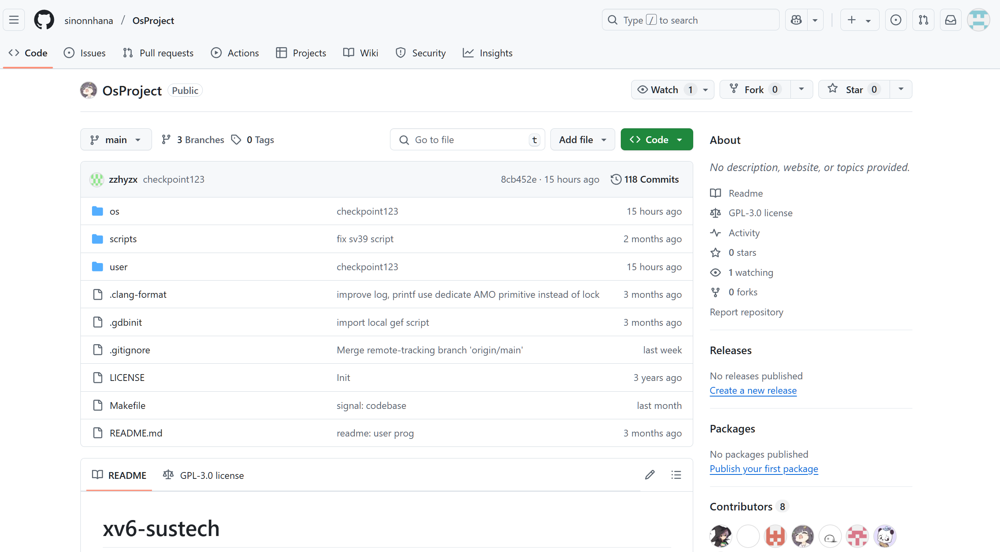
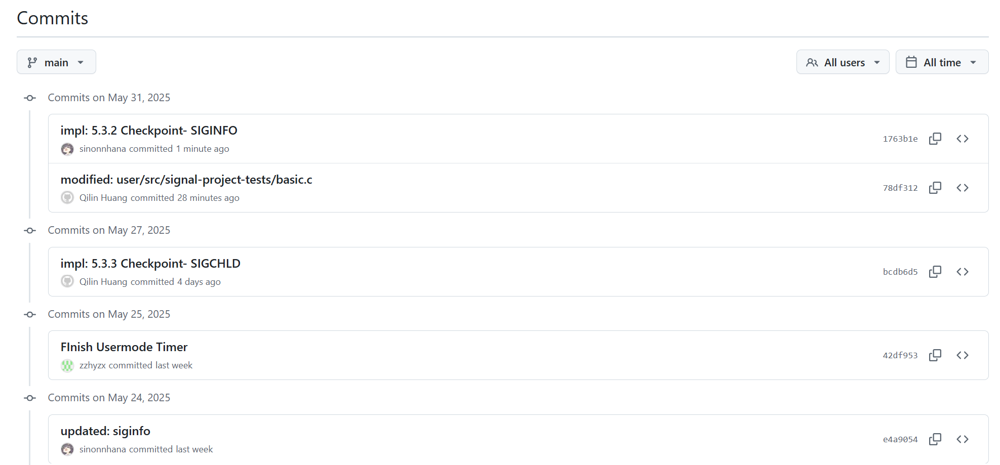
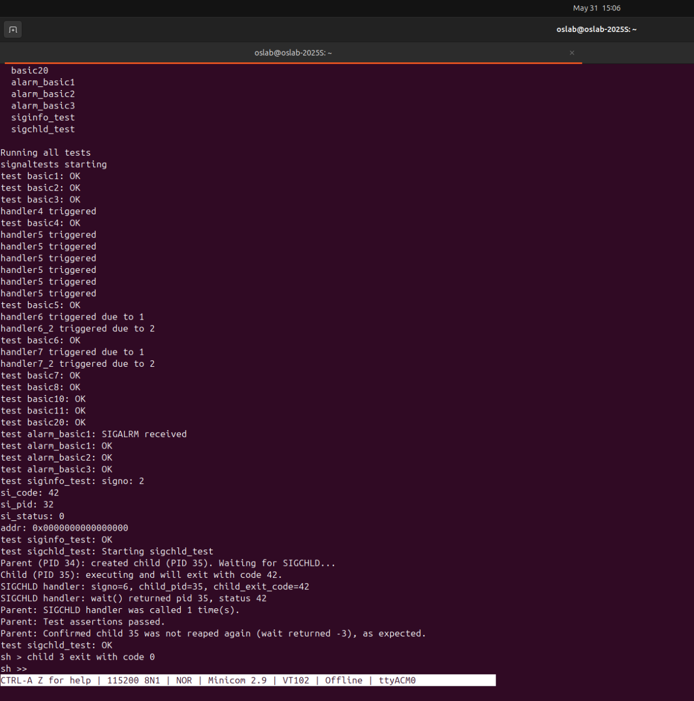

# Project Report (Submission 2)

## 1. Group Members
- 黄棨麟 12212517
- 刘洪玮 12212304
- 朱宇昊 12211224

## 2. Project Overview
本项目在 xv6 内核上实现了类 POSIX 信号机制，包含以下功能：
1. 基本系统调用：`sigaction`、`sigprocmask`、`sigpending`、`sigkill`、`sigreturn`  
2. 在每次从内核返回用户态前检查并交付 Pending 信号  
3. 支持默认处理 (SIG_DFL)、忽略 (SIG_IGN)
4. 信号阻塞与解阻 (`sigprocmask`)、挂起查询 (`sigpending`)  
5. 信号在 `fork` / `exec` 过程中的继承与重置  
6. 特殊信号 SIGKILL、SIGSTOP: 不可被阻塞或忽略，立即终止或暂停
7. 支持 `alarm(seconds)` 系统调用，在设定时间后向进程发送 `SIGALRM` 信号
8. 在用户态信号处理函数中传入 `siginfo_t` 结构体，包含信号编号、发送者 PID 等信息
9. 子进程退出或被 kill 时向父进程发送 `SIGCHLD` 信号，并通过 `siginfo_t` 提供退出信息
10. 对 alarm，siginfo，SIGCHLD 3个功能提供测试样例

**所有功能均通过项目提供的 signal 测试以及自行编写的补充测试样例验证正确性。**

## 3. 代码仓库与分支管理
https://github.com/sinonnhana/OsProject



**提交记录**：




## 4. 设计与实现

### 4.1 核心数据结构 (`ksignal.h`)

已有实现

```c
struct ksignal {
  sigaction_t sa[SIGMAX + 1];
  siginfo_t   siginfos[SIGMAX + 1];
  sigset_t    sigmask;       // 已阻塞信号集合
  sigset_t    sigpending;    // 挂起信号集合
};
```
- `sa[]` 存储每个信号的处理方式  
- `sigmask`：当前阻塞的信号位图  
- `sigpending`：已生成尚未交付的信号位图  
- `siginfos[]`：每个挂起信号的额外信息 (`si_signo`、`si_pid`、`si_code` 等)

### 4.2 信号初始化
- `siginit(proc *p)`：在 `allocproc` 中调用  
  - 清空 `sigmask`、`sigpending`  
  - 将所有 `sa[s]` 设为 `SIG_DFL`  
  - 将所有 `siginfos` 清零  

```c
int siginit(struct proc *p) {
  p->signal.sigmask = 0;
  p->signal.sigpending = 0;
  for (int s = SIGMIN; s <= SIGMAX; s++) {
    p->signal.sa[s].sa_sigaction = SIG_DFL;
    p->signal.sa[s].sa_mask      = 0;
    p->signal.sa[s].sa_restorer = NULL;
    memset(&p->signal.siginfos[s], 0, sizeof(siginfo_t));
  }
  return 0;
}
```

### 4.3 信号在 fork/exec 继承与重置
- **fork** (`siginit_fork`)：  
  - 子进程继承父进程的 `sa[]` 和 `sigmask`  
  - 清空 `sigpending` 和 `siginfos`  
- **exec** (`siginit_exec`)：  
  - 保留 `sigmask` 与 `sigpending`  
  - 除了已被设为 `SIG_IGN` 的信号，其余全部重置为 `SIG_DFL`

### 4.4 系统调用实现

#### sys_sigaction
- 参数合法性检查 (`SIGMIN..SIGMAX`)  
- 拷贝旧设置到 `oldact`，写回用户空间  
- 从用户空间读入新设置，验证 `SIGKILL`/`SIGSTOP` 不可捕捉或忽略  
- 更新 `p->signal.sa[signo]`，并在设为 `SIG_IGN`/`SIG_DFL` 时清除挂起信号  

#### sys_sigprocmask
- `how` 为 `SIG_BLOCK|SIG_UNBLOCK|SIG_SETMASK`  
- 读写用户的 `set` 或 `oldset`  
- 强制从新掩码中删除 `SIGKILL`、`SIGSTOP`  
- 根据 `how` 更新 `p->signal.sigmask`  

#### sys_sigpending
- 将 `p->signal.sigpending` 拷贝回用户空间  

#### sys_sigkill
- 根据 `pid` 遍历进程表定位目标进程  
- 将 `signo` 加到 `target->signal.sigpending`  
- 填充对应的 `siginfos[signo]`  
- 若目标进程处于 `SLEEPING` 且信号未被阻塞（或 SIGKILL/SIGSTOP），唤醒它  

#### sys_sigreturn
- 从用户栈读取保存的 `ucontext`  
- 恢复 `p->signal.sigmask`  
- 恢复所有通用寄存器和 `epc`，跳回被打断处  

### 4.5 `do_signal`
在 `usertrap()` 调用后、`usertrapret()` 之前执行：
```c
int do_signal(void) {
  struct proc *p = curr_proc();
  struct trapframe *tf = p->trapframe;

  for (int s = SIGMIN; s <= SIGMAX; s++) {
    if (!sigismember(&p->signal.sigpending, s)) continue;
    if (sigismember(&p->signal.sigmask, s)) continue;

    void *hdl = p->signal.sa[s].sa_sigaction;
    // 忽略
    if (hdl == SIG_IGN) {
      sigdelset(&p->signal.sigpending, s);
      continue;
    }
    // 默认
    if (hdl == SIG_DFL) {
      if (s != SIGCHLD) {
        setkilled(p, -10 - s);
        return 0;
      }
      sigdelset(&p->signal.sigpending, s);
      continue;
    }
    // 捕捉：在用户栈构造 siginfo/ucontext，修改 trapframe -> 跳转 handler
    …（详见代码）…
    return 0;
  }
  return 0;
}
```
- 按信号编号顺序查找第一个可交付信号 
- 清除挂起、修改进程上下文、设置用户态寄存器，准备执行用户处理函数  

### 4.6 `alarm` 实现机制

在进程内设置定时器，并在指定时间后自动向其发送 `SIGALRM` 信号：

```c
int sys_alarm(int seconds) {
    struct proc *p = curr_proc();

    if (seconds < 0)
        return -1;

    int ticks = seconds * 100;  // 假设时钟频率为每秒 100 tick

    int remaining_ticks = p->signal.alarm_ticks_left;

    if (seconds == 0) {
        // 取消 alarm
        p->signal.alarm_ticks_left = 0;
        p->signal.alarm_interval = 0;
    } else {
        // 设置新的 alarm 定时器
        p->signal.alarm_ticks_left = ticks;
        p->signal.alarm_interval = ticks;
    }

    return remaining_ticks / 100;  // 返回旧的剩余秒数
}
```

- 调用 `alarm(seconds)` 后，进程保存倒计时 tick 数
- 如果参数为 0，表示取消当前定时器
- 返回值为原来设定的剩余秒数（若无则为 0）

在系统时钟中断处理流程中加入周期性检查逻辑：

```c
for (int i = 0; i < NPROC; i++) {
    struct proc *p = pool[i];
    acquire(&p->lock);
    if (p->state != UNUSED && p->signal.alarm_ticks_left > 0) {
        p->signal.alarm_ticks_left--;
        if (p->signal.alarm_ticks_left == 0) {
            sigaddset(&p->signal.sigpending, SIGALRM);
        }
    }
    release(&p->lock);
}
```

- 系统每次时钟中断时检查所有进程
- 若发现某进程设置了 alarm，且 `alarm_ticks_left` 归零，则向其添加 `SIGALRM` 到 `sigpending`
- 同时构造对应的 `siginfo_t`，为用户态 handler 提供信号来源信息

### 4.7 `siginfo_t` 构造与传入用户处理函数

在 `usertrap()` 调用后、`usertrapret()` 之前执行 `do_signal()` 中：

```c
siginfo_t *info = &target_p->signal.siginfos[signo];
info->si_signo  = signo;
info->si_code   = code;
if (sender) {
    info->si_pid = sender->pid;  // 用户进程发送，记录 sender pid
} else {
    info->si_pid = -1;           // 内核信号，填充 -1
}
info->si_status = 0;
info->addr = 0;
```

- 当捕捉到可交付信号时，提前构造 `siginfo_t` 结构体并填充关键信息
- `si_signo` 为信号编号，`si_pid` 为信号来源进程 pid，若来自内核则为 -1
- 其余字段（如 `si_status`, `addr`）根据标准要求默认置 0
- 构造后的 `siginfo_t` 被压入用户栈，在跳转到用户态 signal handler 时作为第二个参数传入

### 4.8 `SIGCHLD` 信号发送与子进程退出通知

在进程退出或被 kill 时（如 `exit()` 或 `setkilled()` 中）：

```c
if (p->parent) {
    struct proc *parent_proc = p->parent;
    acquire(&parent_proc->lock);

    sigaddset(&parent_proc->signal.sigpending, SIGCHLD);

    siginfo_t *info = &parent_proc->signal.siginfos[SIGCHLD];
    info->si_signo = SIGCHLD;       // 固定为 SIGCHLD
    info->si_pid = p->pid;          // 退出子进程的 PID
    info->si_code = code;           // 子进程退出状态（正常退出或被信号终止）
    info->si_status = code;         // 与 si_code 保持一致
    info->addr = 0;                 // 对于 SIGCHLD 不适用

    void *handler = parent_proc->signal.sa[SIGCHLD].sa_sigaction;
    if (parent_proc->state == SLEEPING &&
        parent_proc->killed == 0 &&
        handler != SIG_DFL &&
        handler != SIG_IGN &&
        !sigismember(&parent_proc->signal.sigmask, SIGCHLD)) {
        parent_proc->state = RUNNABLE;
        add_task(parent_proc);
    }

    release(&parent_proc->lock);
}
```

- 子进程退出时自动向父进程发送 `SIGCHLD` 信号
- `siginfo_t` 中记录退出子进程的 PID 与退出码，便于父进程在 handler 中使用
- 若父进程注册了 SIGCHLD 的自定义 handler、且未屏蔽该信号，立即唤醒父进程以处理回收
- 避免父进程长期阻塞等待，符合 POSIX 信号的异步通知语义

### 4.9 alarm、siginfo 与 SIGCHLD 信号处理测试

新增测试涵盖了三项自选 checkpoint，验证了定时信号触发、信号附加信息传递以及子进程退出通知的实现：

- **alarm 定时信号触发**：通过 `alarm_basic1/2/3` 测试 `alarm(seconds)` 是否能准确在指定时间后向当前进程发送 `SIGALRM` 信号，并调用用户注册的 handler。测试包括信号触发、取消和覆盖三个场景，确保定时信号逻辑正确。
- **siginfo 结构体填充验证**：通过 `siginfo_test` 测试信号发送时 `siginfo_t` 结构体中字段的正确填充，特别是 `si_signo`（信号编号）、`si_pid`（发送者进程 PID）和 `si_code`（附加代码）是否正确传递给用户态 handler，保证用户可以准确获取信号来源和信息。
- **SIGCHLD 信号与子进程退出通知**：通过 `sigchld_test` 测试子进程退出时自动向父进程发送 `SIGCHLD` 信号，并在父进程的 handler 中通过 `siginfo_t` 获取子进程的 PID 和退出码，同时在 handler 内调用 `wait()` 回收子进程资源。测试验证了信号发送、信息填充及子进程资源正确回收，确保父进程无需主动等待即可处理子进程退出。

该测试全面验证了定时信号的准确发送、信号信息的正确传递，以及进程间退出通知机制的完整实现。

## 5. Base Checkpoints

| Checkpoint | 功能                                        | 得分 |
| ---------- | ------------------------------------------- | ---- |
| 1          | sigaction、sigkill、do_signal、sigreturn 等 | 50   |
| 2          | SIGKILL 特殊处理                            | 10   |
| 3          | fork/exec 信号继承与重置                    | 10   |

目前所有 **Base Checkpoint 1/2/3** 均已实现并通过 `signal` 测试。

## 6. Optional Checkpoints

| Checkpoint | 功能                                           | 得分 |
| ---------- | ---------------------------------------------- | ---- |
| 5.3.1      | 实现 `alarm` 系统调用，定时发送 `SIGALRM` 信号 | 10   |
| 5.3.2      | 支持 `siginfo_t` 结构体并传入用户态处理函数    | 10   |
| 5.3.3      | 实现 `SIGCHLD` 通知父进程并提供退出信息        | 10   |

所有 **Optional Checkpoint 5.3.1–5.3.3** 均已实现，并通过项目测试与自定义测试样例验证功能正确性。

## 7. 测试结果

在连接开发板后，于 xv6 shell 中依次执行：
```sh
# 编译并启动 xv6
make clean && make run

# 在 shell 中运行提供的test脚本
sh >> signal
```
所有测试点均 **PASS**且通过上机测试。



## 8. 遇到的问题与解决

1. 用户空间内存拷贝的并发安全
   - 在调用 `copy_to_user` 或 `copy_from_user` 拷贝用户态内存时，必须先获取并保持 `p->mm->lock`。
     这样才能确保在整个拷贝过程内，进程的虚拟内存映射不会因别的线程或 `exec` 操作被修改，避免出现页表不一致或竞争条件导致的异常。
2. 信号状态修改的原子性
   - 对信号相关数据结构（`p->signal`）进行读写时，需要获取 `p->lock`。
     对用户内存拷贝则额外获取 `p->mm->lock`，避免在内外锁混用时产生死锁，也能保证数据一致性。
3. 重复定义 SIGCHLD 对应返回值导致错误
   - 在不同的源码文件中重复定义了 `SIGCHLD` 信号相关的返回值，导致编写测试用例时无法正确对应和识别该返回值，影响测试用例的正确性。
     利用 VSCode 的全局搜索功能，快速定位所有重复定义的变量，统一修改或删除多余定义，确保信号返回值唯一且一致。
4. UART 串口连接线插反导致通信失败
   - 上机调试时，使用三根杜邦线连接开发板上的 GND、UART TX、UART RX 端口时，未注意 UART 的 RX 和 TX 是交叉连接的，导致信号无法正常通信。
     检查线路后发现 RX 和 TX 线插反，重新正确交叉连接线路，确保 UART TX 连接到接收端的 RX，UART RX 连接到发送端的 TX，串口通信恢复正常。
5. SD 卡未插紧导致文件上传失败
   - 开发板无法成功上传文件，排查发现是因为 SD 卡未插紧，导致存储设备未被正确识别。
     重新插紧 SD 卡，确保接触良好，文件上传成功，系统能够正常访问 SD 卡内容。

## 9. 结论
本次项目在 xv6 内核中完成了完整的信号框架，满足 Base Checkpoint 及Optional Checkpoint要求。